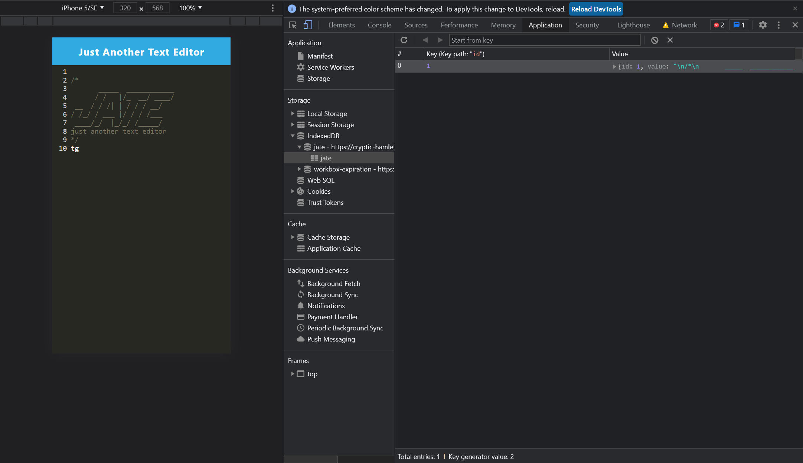

# Text Editor with Progressive Web Applications (PWA) 
A text editor that runs in the browser. The application will be a single-page application that meets the PWA criteria. 

>**Additionally**, it will feature a number of data persistence techniques that serve as redundancy in case one of the options is not supported by the browser. The application will also function offline.

## Database

To implement methods for getting and storing data to an IndexedDB database a package called `idb` is used; which is a lightweight wrapper around the IndexedDB API. It features a number of methods that are useful for storing and retrieving data, and is used by companies like `Google` and `Mozilla`.

## User Story

```md
AS A developer
I WANT to create notes or code snippets with or without an internet connection
SO THAT I can reliably retrieve them for later use
```

## Preview

You will deploy this full-stack application to Heroku using the [Heroku Deployment Guide on The Full-Stack Blog](https://coding-boot-camp.github.io/full-stack/heroku/heroku-deployment-guide).

**Important**: Make sure your submission includes the `.npmrc` file in this starter code.  This will ensure your application will deploy properly to heroku.

The following animation demonstrates the application functionality:


The following image shows the application's `manifest.json` file:


The following image shows the application's registered service worker:


The following image shows the application's IndexedDB storage:


